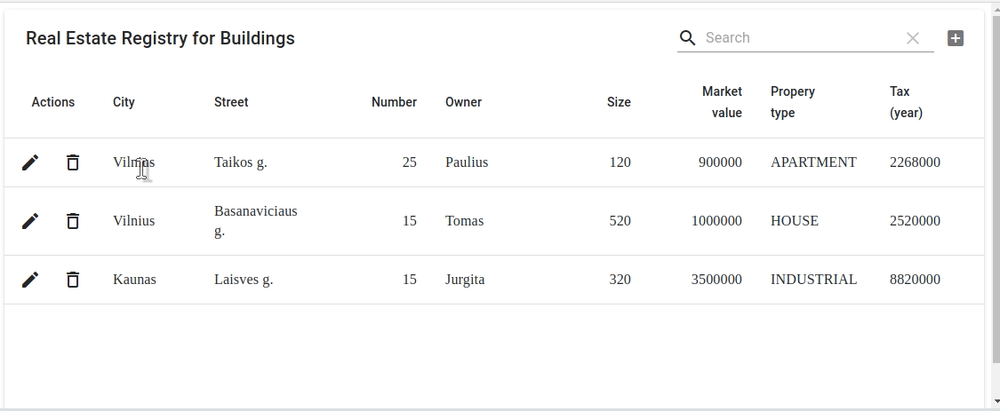

###Swagger API 
http://localhost:8080/swagger-ui.html

###H2 database 
http://localhost:8080/h2-console

#### Frontend 
http://localhost:3000/



#Instructions


#### In order to run Spring Project

```$ mvn spring-boot:run```

#### In order to run React
```
$ cd frontend/
$ npm install 
$ npm start
```